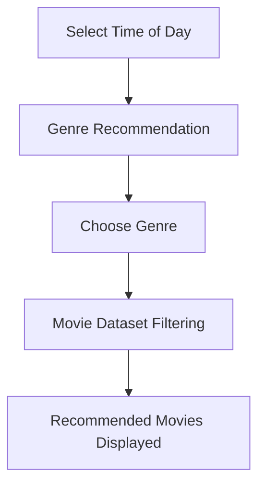

# 🎬 CineMatch — Time-Based Movie Recommendation System

### 🎥 Smart Movie Recommendations Based on Time & Human Psychology

*Stop scrolling endlessly and start watching instantly.*

🔗 **Live Demo:** https://movie-recommendation-system-12-8a23.onrender.com

---

## 🌟 Overview

Have you ever spent **30 minutes searching for a movie** and only **10 minutes actually watching one?**

**CineMatch** solves this problem using a **Time-Based Recommendation System** inspired by common human psychological viewing preferences.

Instead of overwhelming users with hundreds of options, CineMatch:

✅ Suggests genres according to the selected time of day

✅ Filters movies from a curated dataset

✅ Delivers instant recommendations

✅ Provides a simple and intuitive experience

---

## 🎯 The Problem

Modern streaming platforms often suffer from:

* 🎬 Too many movie choices
* 😵 Decision fatigue
* ⏳ Time wasted browsing
* 🤔 Difficulty matching movies with mood

### Our Goal

Provide users with **quick and relevant movie suggestions** based on the time they're planning to watch.

---

## 💡 How CineMatch Works



---

## 🕒 Time-Based Genre Mapping

| Time Period  | Recommended Genres          |
| ------------ | --------------------------- |
| 🌅 Morning   | Motivational, Comedy, Drama |
| ☀️ Afternoon | Action, Adventure, Sci-Fi   |
| 🌇 Evening   | Romantic, Family, Fantasy   |
| 🌙 Night     | Horror, Thriller, Mystery   |

---

## ⚙️ Recommendation Methodology

### Step 1️⃣ — Select Viewing Time

Users choose one of the following:

* 🌅 Morning
* ☀️ Afternoon
* 🌇 Evening
* 🌙 Night

### Step 2️⃣ — Genre Recommendation

The system recommends genres associated with that time period.

### Step 3️⃣ — Movie Filtering

Movies are filtered from the dataset based on genre matching.

### Step 4️⃣ — Instant Recommendations

Relevant movies along with their descriptions are displayed.

---

## 🧠 Algorithm Used

### Rule-Based Recommendation System

Unlike Netflix or Spotify-style recommendation engines that require user history and behavioral data, CineMatch uses a lightweight **Rule-Based Filtering Approach**.

### Example Rules

```text
Morning   → Motivational
Afternoon → Action
Evening   → Romantic
Night     → Horror
```

### Genre Matching Logic

```text
motivational → biography, sports, documentary

romantic → romance, love

horror → horror
```

Movies containing matching genres are recommended to the user.

---

## ✨ Features

### 🎯 Core Features

* ✅ Time-based recommendations
* ✅ Psychology-inspired genre suggestions
* ✅ Dynamic movie filtering
* ✅ Instant recommendation generation

### 🎨 User Experience

* ✅ Responsive UI
* ✅ Dark Mode Support
* ✅ Mobile Friendly
* ✅ Simple Navigation

### ⚡ Performance

* ✅ Fast filtering using Pandas
* ✅ Lightweight Flask backend
* ✅ No authentication required

---

## 🛠️ Tech Stack

### Frontend

| Technology | Purpose       |
| ---------- | ------------- |
| HTML5      | Structure     |
| CSS3       | Styling       |
| JavaScript | Interactivity |

### Backend

| Technology | Purpose          |
| ---------- | ---------------- |
| Python     | Core Programming |
| Flask      | Web Framework    |

### Data Processing

| Technology | Purpose           |
| ---------- | ----------------- |
| Pandas     | Dataset Filtering |

### Deployment

| Technology | Purpose              |
| ---------- | -------------------- |
| Render     | Hosting & Deployment |

---

## 📂 Project Structure

```bash
Movie_Recommendation_System/
│
├── static/
│   └── style.css
│
├── templates/
│   └── index.html
│
├── movies_list.csv
├── app.py
├── requirements.txt
├── README.md
│
└── screenshots/
    ├── homepage.png
    └── recommendations.png
```

---

## 📊 Dataset Information

The movie dataset contains:

* 🎬 Movie Title
* 🎭 Genre
* 📝 Overview

### Sample Records

| Movie         | Genre            | Overview                     |
| ------------- | ---------------- | ---------------------------- |
| Rocky         | Sports, Drama    | Inspirational boxing journey |
| The Conjuring | Horror, Thriller | Paranormal investigation     |
| Titanic       | Romance, Drama   | Love story on a doomed ship  |

---

## 🚀 Getting Started

### 1️⃣ Clone the Repository

```bash
git clone https://github.com/utkarsh-0106/Movie_Recommendation_System.git
```

### 2️⃣ Navigate to Project Directory

```bash
cd Movie_Recommendation_System
```

### 3️⃣ Install Dependencies

```bash
pip install -r requirements.txt
```

### 4️⃣ Run the Application

```bash
python app.py
```

### 5️⃣ Open in Browser

```text
http://127.0.0.1:5000
```

---

## 📸 Application Screenshots

### 🏠 Home Page

> Add screenshot here

```text
screenshots/homepage.png
```

### 🎬 Recommendation Results

> Add screenshot here

```text
screenshots/recommendations.png
```

---

## 🔮 Future Enhancements

### Phase 1

* ⭐ User Rating System
* 🎞️ Movie Posters
* 🔍 Better Genre Matching

### Phase 2

* 🎬 TMDB API Integration
* 📋 Personal Watchlists
* ❤️ Favorites System

### Phase 3

* 🤖 Machine Learning Recommendation Engine
* 😊 Mood Detection Recommendations
* 🧠 Personalized User Profiles
* 📈 Recommendation Analytics

---

## 🎓 Academic Relevance

This project demonstrates practical implementation of:

* Recommendation Systems
* Human Psychology & User Behavior
* Flask Web Development
* Data Filtering Techniques
* Frontend–Backend Integration
* Dataset-Based Decision Systems

### Suitable For

* 🎓 BCA Projects
* 🎓 MCA Projects
* 🎓 B.Tech Mini Projects
* 🎓 Computer Science Coursework

---

## 👨‍💻 Author

### Utkarsh

🔗 GitHub: https://github.com/utkarsh-0106

---

## 🤝 Contributing

Contributions, ideas, and suggestions are welcome!

1. Fork the repository
2. Create a feature branch
3. Commit your changes
4. Push to GitHub
5. Open a Pull Request

---

## 📜 License

This project is developed for **educational and learning purposes**.

Feel free to use and modify it for academic projects and experimentation.

---

### ⭐ If you like this project, consider giving it a star!

**Made with ❤️ using Flask & Python**
